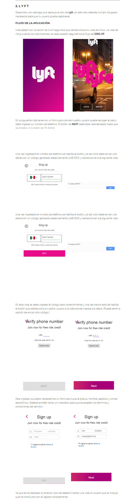

## Foodmap:
### Programa: Realizar una web-app.

**Descripción del proyecto:**
Diseñar una web-app que replique el sitio web: Lyft

**Herramientas que se utilizaron:**

* HTML.
* CSS.
* JS.
* jQuery.

**Objetivo del proyecto:**

